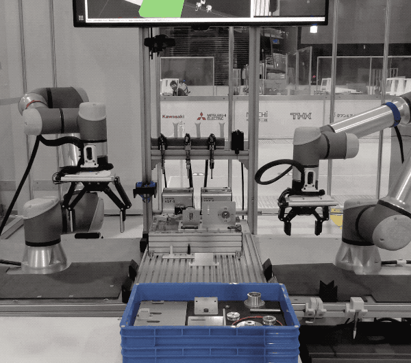
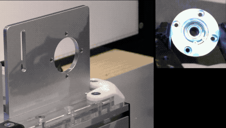
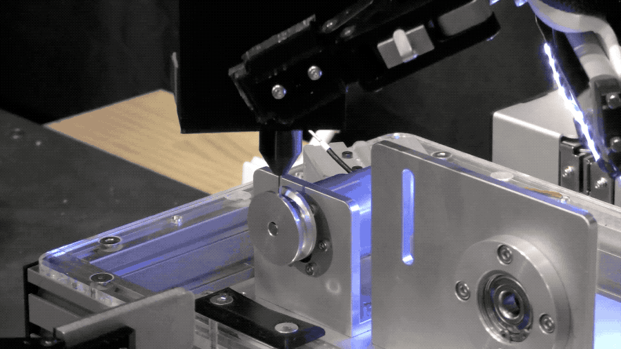
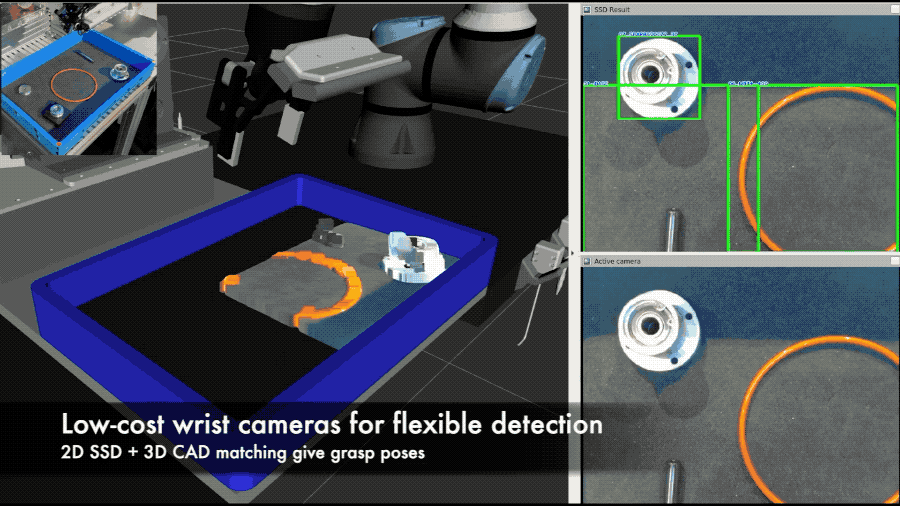
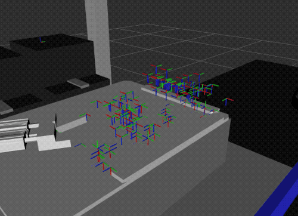

# Team O2AC at the World Robot Summit 2020 Assembly Challenge

This repository provides the robot solution and a common runtime/development environment used by Team O2AC in the Assembly Challenge of the [World Robot Summit 2020](http://worldrobotsummit.org/en/).

See our intro video here:

https://www.youtube.com/watch?v=Dm76puapISY

See our exhibition talk and demo here:

https://www.youtube.com/watch?v=tue42LWGzO0&t=2090s

See our completed taskboard run here:

https://www.youtube.com/watch?v=u2Hrf--aK5k&t=21522s

## SUMMARY

This repository contains both the ROS packages used to control the O2AC robot system, as well as a series of shell scripts and Docker images to build and run the code.  
With this, you can:

- Use two robot arms
- Plan and execute motions simultaneously and independently on each arm, without risk of collision

- Perform insertions using impedance control 
- Align parts 

- Execute motion sequences while subsequent motions are being planned, minimizing waiting times
- Fasten screws

- Use a 3D-printed screw tool (under $100 USD in parts) with compliance to find and fasten set screws

- Detect and pick parts from an unstructured tray

- Generate parts assemblies and use their TF frames

- Complete the WRS2020 taskboard task
- Complete the WRS2020 assembly task (with enough luck)

## QUICK START

1) Clone the repository into your home folder in Ubuntu 18.04 (or newer).
2) Install the development environment (`SETUP-DEVEL-MACHINE.sh`, then `BUILD-DOCKER-IMAGE.sh`)
3) Run `LAUNCH-TERMINATOR-TERMINAL.sh`
4) Execute `roslaunch o2ac_moveit_config demo.launch` and `rosrun o2ac_routines assembly.py` (in separate terminals)
5) Read the [documentation](https://github.com/o2ac/o2ac-ur/wiki), check the [Troubleshooting page](https://github.com/o2ac/o2ac-ur/wiki/troubleshooting) if you have any problems, and report an issue if you are still stuck afterwards.

## Contribution Guidelines

Please read the contribution guidelines before pushing code or requesting a merge. Details can be found in the wiki:  
https://github.com/o2ac/o2ac-ur/blob/main/CONTRIBUTING.md

## Reporting Issues

Minor compatibility issues are expected to arise. Please report any issue by using the issue tracker:
https://github.com/o2ac/o2ac-ur/issues

## Citing

If you find this repository useful, please star it and cite our papers:

Felix von Drigalski, Chisato Nakashima, Yoshiya Shibata, Yoshinori Konishi, Joshua C. Triyonoputro, Kaidi Nie, Damien Petit, Toshio Ueshiba, Ryuichi Takase, Yukiyasu Domae, Taku Yoshioka, Yoshihisa Ijiri, Ixchel G. Ramirez-Alpizar, Weiwei Wan & Kensuke Harada (2020) Team O2AS at the world robot summit 2018: an approach to robotic kitting and assembly tasks using general purpose grippers and tools, Advanced Robotics, 34:7-8, 514-530, DOI: 10.1080/01691864.2020.1734481  
[arXiv](https://arxiv.org/abs/2003.02427)

Felix von Drigalski, Christian Schlette, Martin Rudorfer, Nikolaus Correll, Joshua C. Triyonoputro, Weiwei Wan, Tokuo Tsuji & Tetsuyou Watanabe (2020) Robots assembling machines: learning from the World Robot Summit 2018 Assembly Challenge, Advanced Robotics, 34:7-8, 408-421, DOI: 10.1080/01691864.2019.1705910  
[arXiv](https://arxiv.org/abs/1911.05884)

Felix von Drigalski, Cristian C. Beltran-Hernandez, Chisato Nakashima, Zhengtao Hu, Shuichi Akizuki, Toshio Ueshiba, Manabu Hashimoto, Kazumi Kasaura, Yukiyasu Domae, Weiwei Wan & Kensuke Harada (2022) Team O2AC at the world robot summit 2020: towards jigless, high-precision assembly, Advanced Robotics, DOI: 10.1080/01691864.2022.2138541

## Credits

The Docker and shell script backbone of this project is based on the HSR environment maintained at the [Emergent Systems Laboratory](http://www.em.ci.ritsumei.ac.jp/), Department of Human and Computer Intelligence, College of Information Science and Engineering, [Ritsumeikan University](http://en.ritsumei.ac.jp/). For support, contact [Coarobo GK](https://coarobo.com/).

Team O2AC at the World Robot Summit 2020 Assembly Challenge consisted of members from **OMRON SINIC X**, **OMRON**, **Osaka University**, **National Institute for Advanced Science and Technology (AIST)** and **Chukyo University**:

- Felix von Drigalski (OMRON SINIC X)
- Kazumi Kasaura (OMRON SINIC X)
- Chisato Nakashima (OMRON)
- Cristian C. Beltran-Hernandez (OMRON SINIC X / Osaka University)
- Hu Zhengtao (Osaka University)
- Toshio Ueshiba (AIST)
- Shuichi Akizuki (Chukyo University)
- Takuma Terasawa (Chukyo University)
- Ryo Miyoshi (Chukyo University)
- Nanako Shimizu (Chukyo University)
- Ryosuke Yamada (Chukyo University)
- Tenho Houda (Chukyo University)
- Yu Horiuchi (Chukyo University)
- Ryosuke Tachi (Chukyo University)
- Manabu Hashimoto (Chukyo University)
- Yukiyasu Domae (AIST)
- Weiwei Wan (Osaka University)
- Kensuke Harada (Osaka University)

We thank each organization for their support and for the approval to release the source code.
