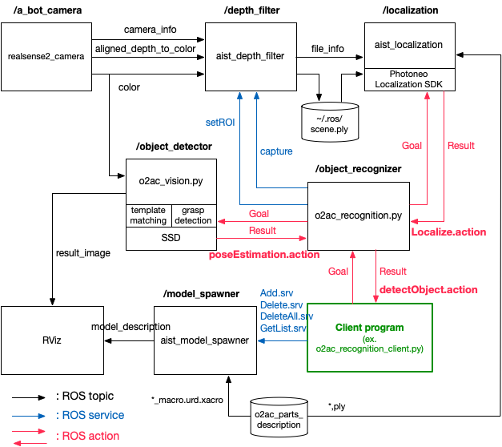

# o2ac_vision

===============

## Introduction

This package contains nodes that execute and advertise vision actions, e.g.:

- Object detection (SSD)
- Part pose estimation (CAD matching)
- Belt grasp pose detection
- Bearing rotation estimation

All vision skills are action-based, so that calculations are allowed to fail and time out.

For this, the Python nodes advertise a number of actions which are defined in o2ac_msgs.

## QUICKSTART

At OSX, run:
```
roslaunch o2ac_vision o2ac_vision.launch
```

This starts up all the nodes processing vision data in the O2AC system.

---
# Part recognition
The part recognition node consists of two components. One is the object detection (Chukyo), the other is pose estimation (AIST).


### Preparation
Part recognition module needs template pre-trained models and templates.
Please download them from following links:

- Pre-trained model weights of SSD
  Rename the downloaded weights to ```WRS.pth``` and place it into ```wrs_dataset/ssd.pytorch```. Please select appropriate weights considering pytorch version.
  - for pytorch version less than 1.6.0: [download](https://drive.google.com/file/d/1uD31_ptek17DBT_dBTwLWFDgMbUcxd2V/view?usp=sharing)
  - for newer version: [download](https://drive.google.com/file/d/15UXmlxeY3SwAeF70ZU2nCYCDJSVMnCkK/view?usp=sharing)
  
- Template images for small parts detection: [download](https://drive.google.com/file/d/1EVTEMdHeOtzsVI9YkVpjS8h_67EkjK4k/view?usp=sharing)
  
  Place ```templates``` into ```wrs_dataset/data/```.
- Template image for bering angle estimation: [download](https://drive.google.com/drive/folders/1qjwkHFLJ4KVpx1_S5BJLbSMZ4lKvtRPZ?usp=sharing)
  
  Place ```bearing_template_image.png``` and ```shaft_template_image.png``` into ```o2ac_vision/config```.

#### Object detection
Python scripts of Single Shot MultiBox Detector (SSD) are based on [ssd.pytorch](https://github.com/amdegroot/ssd.pytorch).
This module detects multiple objects in a tray. 
A list of dictionary which contain bounding box, class id, state(back or front) and confidence is returned.

#### Pose estimation for small parts
This component estimates the 2D pose (x,y,theta) of **small targets** in the image coordinate system. It feeds the output of the object detection module, a list of bounding box and object class id.

#### Bearing and motor pose estimation
This component compute in-plane rotation angle of bering using ICP algorithm.
Counter clock-wise rotation angle and tlanslation are returned.


---

## Recognition pipeline (AIST)
You can construct a pipeline from image acquisition to 3D object recognition as well as localization by using the `o2ac_vision` package, in conjunction with other vision packages, .i.e. `aist_depth_filter`, `aist_localization` and `aist_model_spawner`(optional).
The pipeline is structured as in the following figure:



where the user's application is shown in green. This is a client node of `o2ac_msgs.localizeObjectAction` which is defined as;

```
# Goal
string item_id
# (optional)
geometry_msgs/PoseWithCovarianceStamped expected_pose
---
# Result
bool succeeded
float32[] confidences
geometry_msgs/PoseStamped[] detected_poses
# (optional)
geometry_msgs/PoseWithCovarianceStamped[] detected_poses_with_covariance
```

The client requests the `/object_recognizer` to find the objects specified in the `item_id` field of the action goal. Currently, `item_id` should be a mesh file name (excluding suffix) defined in `o2ac_parts_description/meshes`, e.g. `01-Base`, `04_37D-GEARMOTOR-50-70`, `08_KZAF1075NA4WA55GA20AA0`, etc.

The pipeline works in the following manner;

1. When the ID of object to be recognized is given in the goal, the `/object_recognizer` sends a goal of `o2ac_msgs.get2DPosesFromSSDAction` type to the `/object_detector`.
2. The `/object_detector` searches for the all known objects in a input color image by applying SSD, and then returns part ID and a bounding box to the `/object_recognizer` for each object found.
3. For each of small parts, the `/object_detector` also applies template matching which determines its 2D position and orientation of within the bounding box. They are returned to the `/object_recognizer` together with SSD results.
4. For the round belt, the `/object_detector` finds grasp points by applying the FGE(Fast Graspability Estimation) detector. The grasp points are represented by its 2D position and orientation of the two-finger gripper's motion axis. Multiple grasp points may be found from a single belt in general. They are returned to the `/object_recognizer` together with SSD results.
5. After receiving part ID and the bounding box, the `/object_recognizer` commands the `/depth_filter` to create a point cloud within a subregion corresponding to the bounding box. The created point cloud is stored in `~/.ros/scene.ply` in the Stanford PLY format.
6. For general parts neither small nor belts, the `/localization` node restores the PLY file and performs 3D matching with the meshes stored in `o2ac_parts_description`. If the matching process succeeds, the 3D position and orientation of the part as well as confidence values are returned in the result of `o2ac_msgs.localizeObjectAction` type. If multiple candidate poses are found, they are stored with the descending order of confidence values.
7. For small parts and belts, the `/localization` node converts their 2D positions and orientations to 3D poses under an assumption that the objects lie on a "dominant plane". The "dominant plane" is detected from the entire depth image by the `/depth_filter` with robust plane fitting using RANSAC. The detected plane is published in the message of `aist_depth_filter.FileInfo` type and subscribed by the `/localization` node.

The sample client program `o2ac_vision/scripts/o2ac_recognition_client_example.py` gives an example showing how to use the recognition pipeline from users' application programs. The sample also provides a means for visualizing 3D localization results using `aist_model_spawner`.


## Executing the recognition pipeline

To start up a realsense camera and test the pipeline, run:

```
roslaunch o2ac_vision pipeline_test.launch [camera_name:=<camera name>] [nposes:=<number of poses> timeout:=<timeout for localization in seconds>] [continuous_streaming:=<continuous mode>]
rosrun o2ac_vision o2ac_recognition_client_example.py
```

The correct name of the camera should be given in the `camera_name` parameter.  
If the camera driver is already running, use `o2ac_vision.launch`. Example:

```
roslaunch o2ac_vision o2ac_vision.launch camera_name:=b_bot_outside_camera nposes:=2 timeout:=10 continuous_streaming:=true
```

The first command establishes connections between nodes shown in the figure above and takes the following parameter options;
 - **camera_name** -- name given to the launched camera (default: `b_bot_outside_camera`)
 - **nposes** -- the number of candidate poses to be searched for within timeout. Unfortunately, it is not guaranteed that a pose with the highest confidence value will be returned when this value is set to `1` because the order of the candidate poses returned by the localizer is indeterminate. (default: `2`)
 - **timeout** -- timeout of localization process in seconds. The localization process would be canceled after the timeout has expired even if `nposes` candidates have not been found. (default: `10`)
 - **continuous_streaming** -- If `true`, the pipeline operates in `continuous mode` which continuously processes incoming image streams and outputs the SSD recognition results (but not 3D localization). (default: `false`)

The second command launches a sample client program which provides a CUI(command user interface) for commanding the pipeline to find and localize parts specified by their IDs. The `rqt_reconfigure` GUI is also launched which allows you to ajust various parameters used in the localizer. Please refer to the [the manual for Photoneo Localization SDK](https://photoneo.com/files/manuals/LocalizationSDK/LocalizationSDK1.3-UserManual.pdf) for details.
