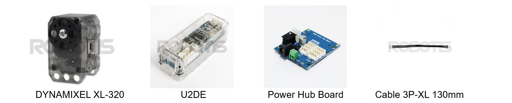
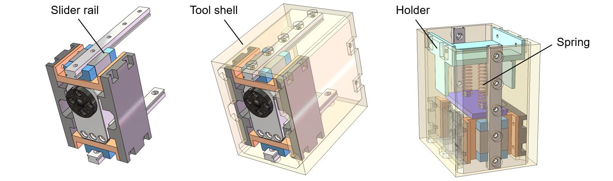
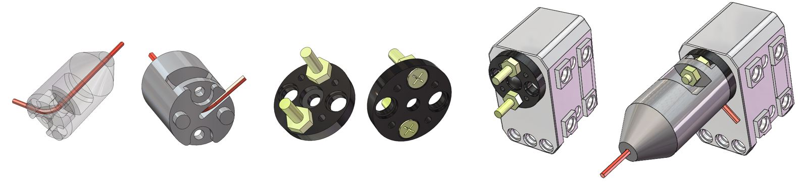
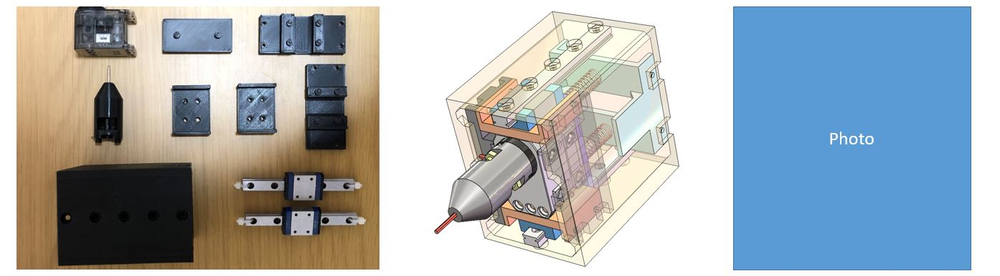
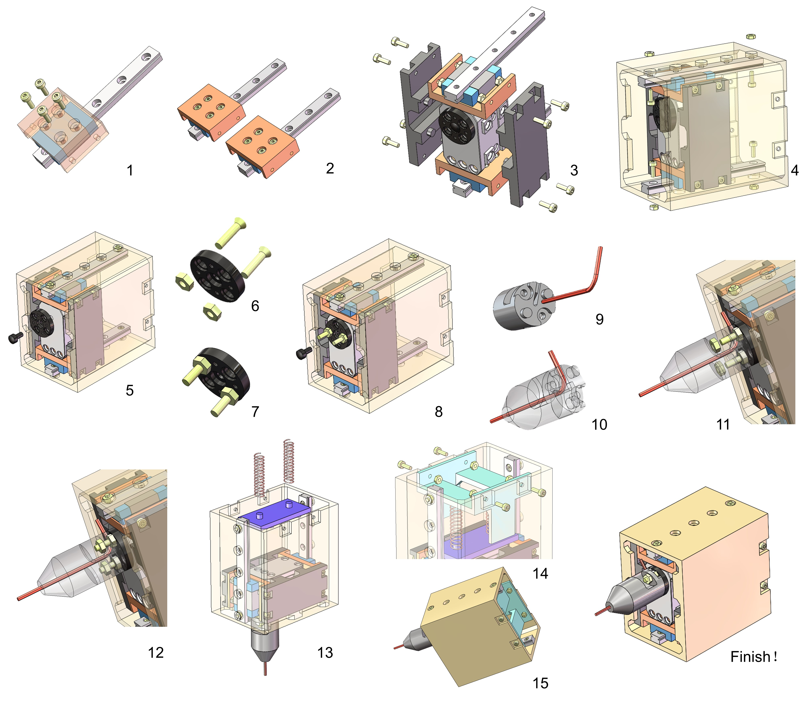

# Screwing Tool
Screw fastening is a challenging and troublesome work in robotic assembly. It's a bad bargain to screw by the rotation of a robot arm, thus, using a peripheral screwing tool is the optimal solution. We propose an extremely simple design of a screwing tool for the use of robots. The tool is powered by a servo motor, and the tooltip is compliant using the embedded spring-rail mechanism. To fabricate it, order the essential standard parts following the purchase list, and 3D-print the customized parts. You are welcome to have a try now!

## Motor
We choose to use [DYNAMIXEL XL-320](https://www.robotis.us/dynamixel-xl-320/), a compact and precise servo motor, which only sells for 23.90 dollars. It can achieve 360° rotation and a maximum torque of 0.39 Nm. Using a servo motor as a driver contributes to a more flexible screwing process, where our system can call a robust failback and also avoid crossing- thread. And, [Power Hub Board](https://www.robotis.us/u2d2-power-hub-board-set/) is used for power supply, [U2D2](https://www.robotis.us/u2d2/) is the applied communication converter for controlling and operating the motor with PC. [Cable 3P-XL](https://www.robotis.us/robot-cable-3p-xl-130mm-5pcs/) is the cable set exclusive for DYNAMIXEL XL-320, which is packaged with the motor and U2D2. 

But, this motor has no threading hole for fixturing. Alternatively, we simply customize a shell to anchor the motor.

    </img>

## Motor Shell
Fixturing the motor with no bolt fastening hole is a sticky problem. We make use of the anchor holes on the motor body for fixing. Four clamp plates with locating pins are designed to surround and button the motor, and they are further fastened with each other by bolts, which fixes the motor in a form closure way. These four plates form a shell of the motor. This shell is equipped with two slide rails and springs so that enables the tooltip to have directed compliance.

    </img>

## Compliance module
Uncertainty is always annoying in screw fastening tasks, there is no simpler way to deal with it other than making the tooltip compliant. We propose to introduce compliance on the motor instead of on the tooltip. The compliance module always makes the tooltip bulky, leading to bad performance in narrow space. Thus, We mount two [slider rails](https://www.monotaro.com/p/4867/2478/?t.q=%83%8A%83j%83A%83K%83C%83h) on the motor shell and the rails are fastened on the tool shell. This mechanism guides the motion of the motor body. On the backside of the motor, another clamp plate is attached, and the locating pins here are used to hook the [spings](https://www.amazon.co.jp/200%E5%80%8B%E5%85%A5%E3%82%8A%E3%80%91%E3%82%B9%E3%83%97%E3%83%AA%E3%83%B3%E3%82%B0-%E5%9C%A7%E7%B8%AE%E3%82%B9%E3%83%97%E3%83%AA%E3%83%B3%E3%82%B0-%E3%83%94%E3%83%83%E3%82%AF%E3%83%84%E3%83%BC%E3%83%AB-%E5%8F%8E%E7%B4%8D%E3%82%B1%E3%83%BC%E3%82%B9%E4%BB%98%E3%81%8D-GRANSTAGE/dp/B08QF6V8XC/). The holder is fixed on the back end of the tool shell. The holder does three things: giving pre-stress on the springs, constraining the extreme position of the motor, leaving paths for the cables.

    </img>

## Tooltip
The tooltip should be strong and accurate. A DIY tooltip is not practical at all. We manage to design a connector that allows a commercial tool to be equipped as a tooltip, for example, a hexagon wrench. The connector can lock the inserted hexagon wrench by the tunnel. It has two through holes for bolt fastening and two locating pins for aligning. We make use of the original motor flange to fix the connector. Two screw bolts are added to provide stable anchor points. To be noted, the screws here should be the [M2.6 flat-head screws](https://www.kohnan-eshop.com/shop/g/g497987446528305/) for matching the hold's size on the flange.  

    </img>

## Purchase list
* [DYNAMIXEL XL-320](https://www.robotis.us/dynamixel-xl-320/) $\times$ 1
* [Power Hub Board](https://www.robotis.us/u2d2-power-hub-board-set/) $\times$ 1
* [U2D2](https://www.robotis.us/u2d2/) $\times$ 1
* [Slider Rails](https://www.monotaro.com/p/4867/2478/?t.q=%83%8A%83j%83A%83K%83C%83h) $\times$ 2
* [Spings](https://www.amazon.co.jp/) $\times$ 1 set
* [M2 bolts and nuts](https://www.amazon.co.jp/waves-%E3%82%B1%E3%83%BC%E3%82%B9%E4%BB%98%E3%81%8D-%E3%82%B9%E3%83%86%E3%83%B3%E3%83%AC%E3%82%B9-%E5%90%8430%E5%80%8B-%E8%A8%88230%E5%80%8B/dp/B07J4LCST6/) $\times$ 1 set
* [M2.6 bolts and nuts](https://www.kohnan-eshop.com/shop/g/g497987446528305/) $\times$ 1 pair

## CAD models
* [Assembly (STEP)](models/STEP/tool_assembly.STEP)
* [Components for printing (STL)](models/STL/)

    </img>

## Assembly sequence
* Note: Assemble and arrange the cable set of the motor at the beginning.

    </img>

